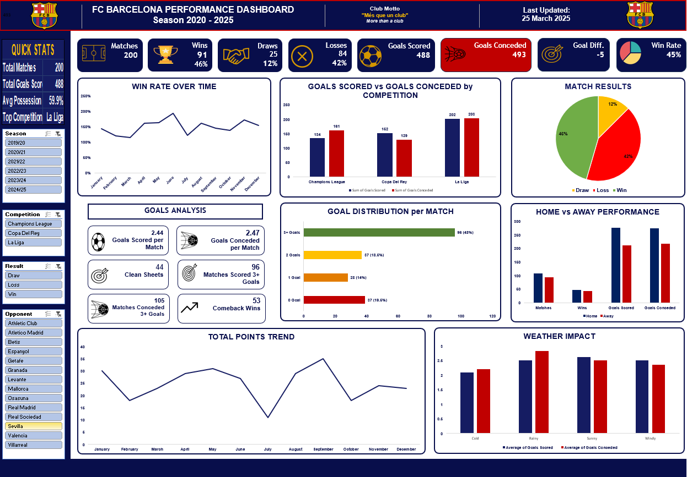

FC Barcelona Performance Analytics

An Excel-based football analytics project analysing FC Barcelona match performance across the 2020–2025 period.

The project transforms match-level data into an interactive dashboard covering results, goals, possession, home and away performance, competition performance, trends, and selected match factors.

Dashboard Preview
## Dashboard Preview

Interactive Excel dashboard developed from the match-level dataset.

Project Overview

This project was built in Microsoft Excel to demonstrate how football match data can be transformed into a structured analytical report and interactive dashboard.

The workbook combines:

Data preparation

KPI calculations

PivotTables

PivotCharts

Interactive slicers

Performance analysis

Trend analysis

Comparative analysis

Dashboard design

The dashboard can be filtered by:

Season

Competition

Result

Opponent

Key Areas of Analysis

Match Performance

The dashboard summarizes overall match outcomes through indicators such as:

Matches played

Wins

Draws

Losses

Goals scored

Goals conceded

Goal difference

Win rate

Goals Analysis

The project examines attacking and defensive output through:

Average goals scored per match

Average goals conceded per match

Clean sheets

Matches scoring 3+ goals

Matches conceding 3+ goals

Comeback wins

Goal distribution per match

Competition Performance

Goals scored and conceded are compared across:

La Liga

Copa del Rey

Champions League

Home vs Away Performance

The dashboard compares home and away matches based on:

Matches played

Wins

Goals scored

Goals conceded

Performance Trends

The project includes trend analysis for:

Win rate over time

Monthly points performance

Goal performance across competitions

Weather Impact

The dashboard provides an exploratory comparison of average goals scored and conceded under different recorded weather conditions:

Cold

Rainy

Sunny

Windy

This analysis is presented as an exploratory relationship rather than a causal conclusion.

Dataset

The dataset contains 200 FC Barcelona match records covering the 2020–2025 period.

The match-level data includes performance, opponent, competition, and contextual variables.

Main Variables

VariableDescription

Date

Match date

Opponent

Opposing team

Home/Away

Match location

Competition

Competition played

Goals Scored

Barcelona goals scored

Goals Conceded

Goals conceded

Possession (%)

Possession percentage

Shots on Target

Shots on target

xG

Expected goals

Pass Accuracy (%)

Passing accuracy

Tackles Won

Tackles won

Key Passes

Key passes

Result

Win, Draw, or Loss

Injury Impact (%)

Recorded injury impact

Rest Days Before Match

Rest period before the match

Opponent Strength (ELO Rating)

Opponent strength measure

Weather Conditions

Recorded weather condition

Managerial Change

Recorded managerial change indicator

Goal Difference

Goals scored minus goals conceded

Total Goals

Combined goals scored and conceded

Dashboard Questions

The analysis is designed to answer questions such as:

How does FC Barcelona's performance vary across seasons?

How do home and away results compare?

How does goal production differ across competitions?

How frequently does Barcelona score three or more goals?

How often does Barcelona keep a clean sheet?

How does win rate vary throughout the year?

How does monthly points performance change over time?

How do goals scored and conceded compare under different weather conditions?

How does performance vary by opponent?

How do match outcomes differ across competitions and seasons?

Excel Skills Demonstrated

Data cleaning and preparation

Data organization

KPI development

Excel formulas

PivotTables

PivotCharts

Slicers

Trend analysis

Comparative analysis

Sports performance analysis

Interactive dashboard development

Data visualization

Report design

Tools

Microsoft Excel

Key Excel features used:

PivotTables

PivotCharts

Slicers

Calculated metrics

Excel Tables

Dashboard layout and formatting

Project Structure

fc-barcelona-performance-analytics/
│
├── README.md
├── dashboard.png
└── FC_Barcelona_Performance_Analytics.xlsx

Files

README.md
Project documentation and dashboard description.

dashboard.png
Preview image of the completed FC Barcelona Performance Dashboard.

FC_Barcelona_Performance_Analytics.xlsx
Excel workbook containing the source data, calculations, PivotTables, PivotCharts, filters, and dashboard.

Analytical Workflow

Match-Level Data
       ↓
Data Preparation
       ↓
KPI Calculations
       ↓
PivotTables
       ↓
PivotCharts
       ↓
Interactive Filters
       ↓
Performance Dashboard

Project Purpose

The purpose of this project is to demonstrate practical Excel data-analysis and dashboard-development skills using a real-world-style sports dataset.

The dashboard focuses on turning raw match records into a clear visual report that allows users to explore performance from different perspectives rather than relying only on individual match statistics.

The same analytical approach can be adapted to business, sales, marketing, finance, and operational datasets.

Author

Rachel Konadu Gyamfi

Data Analyst | Excel | SQL | Python | Power BI

Connect

LinkedIn: linkedin.com/in/rachel-konadu-gyamfi  

GitHub: https://github.com/cyber-rachel
